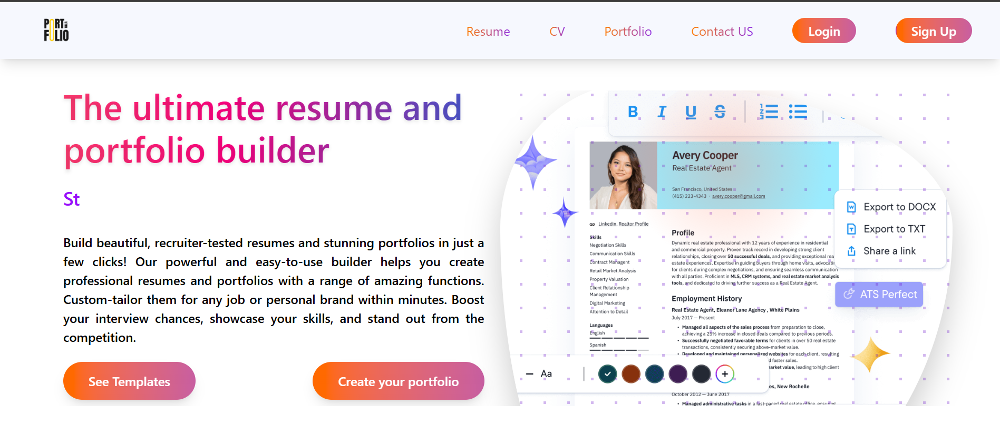
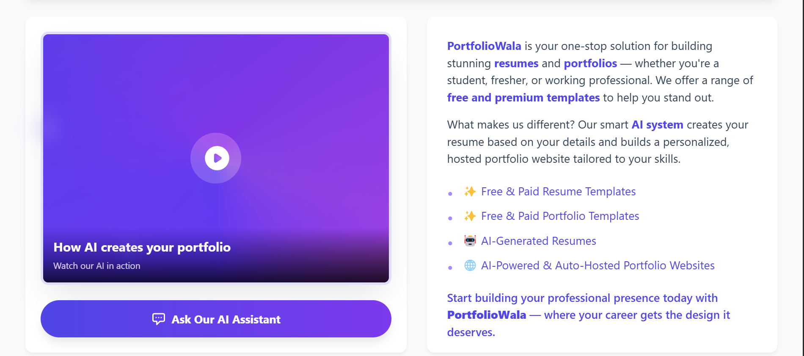

# 🌟 PortfolioWala – AI-Powered Resume & Portfolio Builder

**PortfolioWala** is an AI-powered Resume and Portfolio website builder that allows users to create stunning, personalized portfolios and resumes using free or paid templates. Whether the user wants to build it manually or let AI take over – PortfolioWala does it all!

---

## 🚀 Project Status

⚠️ **Currently in Development**

- ✅ Front page UI is completed
- ⏳ Other pages and AI integration are in progress
- 🔜 Deployment and template library are upcoming

---

## 🎯 Project Purpose

Creating a personal portfolio or resume can be time-consuming and confusing. **PortfolioWala** solves this by offering:

- Professionally designed templates (free and premium)
- Smart template recommendations using AI
- Automatic portfolio generation based on user profile
- Hosting the final website without user needing technical knowledge

---

## 🧠 Key Features

- 🎨 Free & Paid resume and portfolio templates
- ✍️ Manual customization for users who want more control
- 🤖 **AI Generator**: Enter your details → Get full portfolio generated
- 📤 **Auto Hosting**: The system hosts the final portfolio website for the user
- 🧠 **Smart Suggestions**: If the user is unsure, AI recommends the best suitable design based on their profile

---

## 🛠️ Tech Stack

| Category           | Technology                   |
| ------------------ | ---------------------------- |
| **Frontend**       | Angular                      |
| **Language**       | TypeScript, HTML, SCSS       |
| **Styling**        | SCSS / CSS                   |
| **AI Integration** | Planned with ML libraries    |
| **Hosting**        | (Planned) Auto-deploy system |

---

## 📁 Folder Structure

```bash
PortfolioWala/
│
├── src/
│   ├── app/             # Angular components, services, modules
│   ├── public/          # Images, icons, logos
│   └── index.html       # Root HTML file
│
├── angular.json         # Angular config
├── package.json         # Project dependencies
└── README.md            # This file
```

💻 How to Run Locally
Follow these steps to run the project on your local machine:

# Clone the repository

git clone https://github.com/yourusername/PortfolioWala.git

# Navigate to the project directory

cd PortfolioWala

# Install dependencies

npm install

# Run the development server

ng serve

## 📸 Screenshots

### 🖥️ Home Page UI




## 📅 Upcoming Features

🤖 Full AI integration for auto-portfolio generation

💳 Payment gateway for purchasing premium templates

🚀 Automated hosting of user portfolios

🧾 Resume PDF export and download

🔐 User dashboard and login/signup system

## 🙌 Contributing

Currently, this is a solo college project in progress.
In future, contributions and collaborations are welcome!

## 🙋‍♂️ About the Creator

Made with 💻 and ☕ by Dwaipyan Singha
📧 For internship queries or collaborations: Reach out anytime

🚧 This is a college-level project under active development. Feedback and suggestions are always appreciated!
